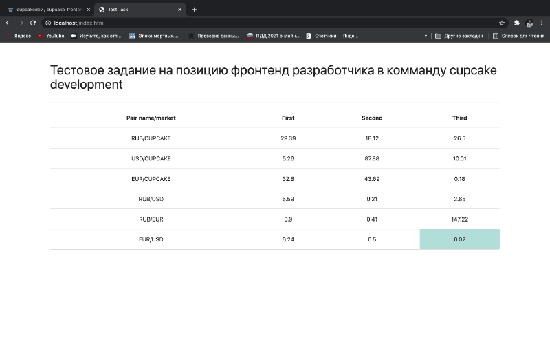

## Тестовое задание

## Задание

Необходимо в реальном времени отображать значение полученных с API валютных пар. В качестве фронтенд фреймворка использован React.  



## Логика выполнения

В ходе выполнения задания я решил остановиться на варианте создания монорепозитория, так как это открывает возможность создания контрактов, общих для серверной и клиентской части, что может быть полезным для разработки в перспективе. Также оставить единый подход к разработке с использованием Typescript.

Во время разработки я не уделил внимание созданию интерфейсов TypeScript, предположив, что данную работу лучше сделать на этапе описания контрактов и реализации юнит-тестирвания.

Мною были внесены изменения в исходном к заданию коде:

Отредактирован Dockerfile, в частности для того, чтобы сделать раздачу статических фалов силами Nginx. Это позволит лищний раз не нагружать поток данных Node.js и с моей точки зрения, Nginx более подходит для этой задачи.

Запуск Dockerа реализуйте командой:

```bash
$ docker build -t 1.0.0 . && docker run -p 80:80 -p 443:443 -v `pwd`:/www/ --name test-task-nginx-start 1.0.0
```

Будут подхвачены необходимые конфигурационные файлы config --> nginx.conf и vhost.conf. После этого для работы с приложением можно использовать 80 порт.

Статические файлы для Nginx, формируются в папке public, после запуска соответствующей команды

```bash
$ npm run build:client
```

Webpack сделает всю необходимую работу: webpack && cp ./src/client/index.html ./public

Я добавил определение глобальной переменной NODE_ENV=development, чтобы не ломать исходный код серверной части. 

Если вы захотите вернуться к разработке или тестированию API, с испозьзованием Swagger, то запустите приложение в режиме разработки

```bash
$ npm run start:dev
```

В обычном режиме, вы не увидите визуализацию API через Swagger, а будете сразу перенаправлены с localhost на localhost/index.html. Для запуска приложения вне режима разработки используйте команду

```bash
$ npm run start
```

Для стилизации HTML я использовал внешние скрипты Materialize CSS

На стороне клиента были созданы несколько родительских классов и использованы далее:

Currency - родительский - используется при наследовании в FactoryCerrency
FactoryCerrency - создает нужный экземпляр класса, в зависимости от типа валюты поступающей от API
ProxyCurrentcy - при создании экземпляра класса currency валидирует отрицательные значения

Market - родительский - обрабатывает данные поступающие с API
FactoryCerrency - создает нужный экземпляр класса, в соответствии с тем, к какому поставщику котировок мы обратились
ProxyMarket - при первом запросе к API создает поставщика котировок и помещает его в StoreMarket. В последующем производит обновление данных, если это необходимо.

Store - единственно верный источник данных о поставщиках, котировках и значниях валютных пар

SubscribeAPI - обеспечивает бесперебойое получение данных оn заданных API. Так, как API работает не стабильно основан на Promise.race с регулируемым параметром. Подписка на получение данных от API и необходимые настройки делаются в App.tsx при создании экземпляра класса.

Observer - создает подписки для React.useState на изменение данных - перерендеринг. Срабатывает при появлении изменений в Store.
